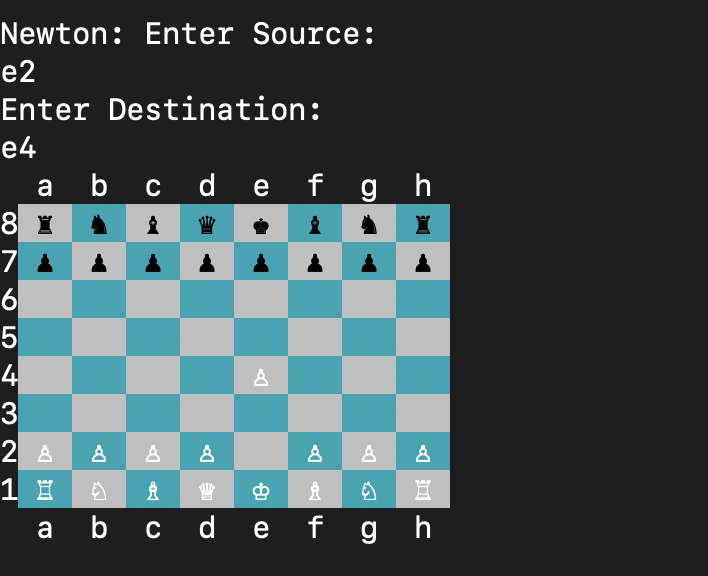
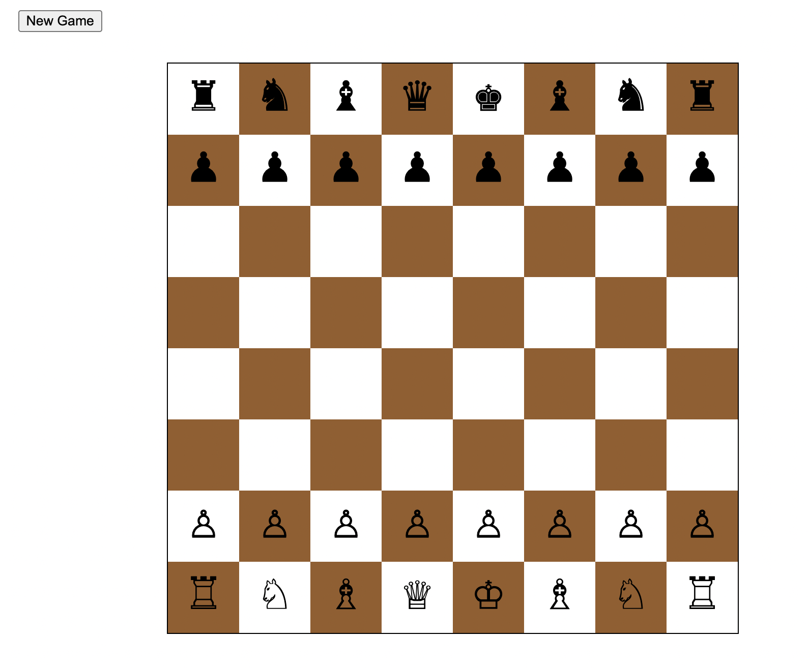

# Asynchronous Multiplayer Chess

## Summary Description

The primary goal of this project was to build a terminal-based implementation 
of the chess game. We started with a local terminal-based implementation of the game
and then created a communication library so that two players would be able to play
with each other a server. We also tried to implement a GUI for the game.

## Project Execution Summary

1. Terminal based 1v1 game:

 

2. Created the communicator library
3. Created an asynchronous server
4. Created a webserver to play the game
    

## Usage

**Play Locally**:\
cd chess_application/chess
cargo run

**Play on GUI**:\
Start server: 
    cd chess_application/server
    cargo run
  
Start Player1:
    cd chess_application/chessApp
    cargo run 127.0.0.1:8080

Local server gets created for Player1, can access on browser using 127.0.0.1:8080

Start Player2:
    cd chess_application/chessApp
    cargo run 127.0.0.1:8081
    
Local server gets created for Player2, can access on browser using 127.0.0.1:8081


## Additional Details

`dependencies`:
  - `chess`
    - colored = "2"
    - matrix_display = "0.9"    
    - regex = "1.5"
    - communicator = {path = "../communicator"}
  - `chessApp`
    - regex = "1.5"
    - communicator = {path = "../communicator"}
    - chess = {path = "../chess"}
    - serde = { version = "1", features = ["derive"] }
    - serde_json = "1.0"
  - `server`
    - async-std = "1.11"
    - futures = "0.3"
    - chess = {path = "../chess"}
    
  - The implementation involves four modules:
    - `chess`:
      - Implementation of complete chess logic
      - Independent library that can be used in terminal 1v1, server-based terminal 1v1,
        GUI-based 1v1 chess game
    - `communicator`:
      - Creates connections between two sockets - a server and a client
      - Effectively transmits data as a string between the server and client
    - `server`:
      - Creates an asynchronous server that accepts connections to play the
        chess game.
      - Matches two players and creates a chess game
      - Acts as a referee between the two players
    - `chessApp`:
      - Creates a local webserver to create a GUI for the user
      - Effectively connects with a server and communicates moves
        & the state of the game
        
  - We used Serde to serialize data and send it across to the user
    in JSON format.
    ```rust
    #[derive(Serialize, Deserialize, Debug)]
    struct GameState {
        encoded_game_state: String,
        board: String,
        is_checkmate: bool,
        is_stalemate: bool,
        request_draw: bool,
    }
    ```
  - Challenges:
    - Hard to maintain multiple TCP connections and uniquely identify
      the players
    - Front-end frameworks in Rust have a steep learning curve
    
  - Learnings:
    - Tried to implement the front-end using druid
    - Creating separate modules for independent functionalities
      makes a lot of difference in debugging/implementation
    - Rust' strict compiler indeed prevents a lot of run-time bugs
      which would have not been caught in other languages
  
  


